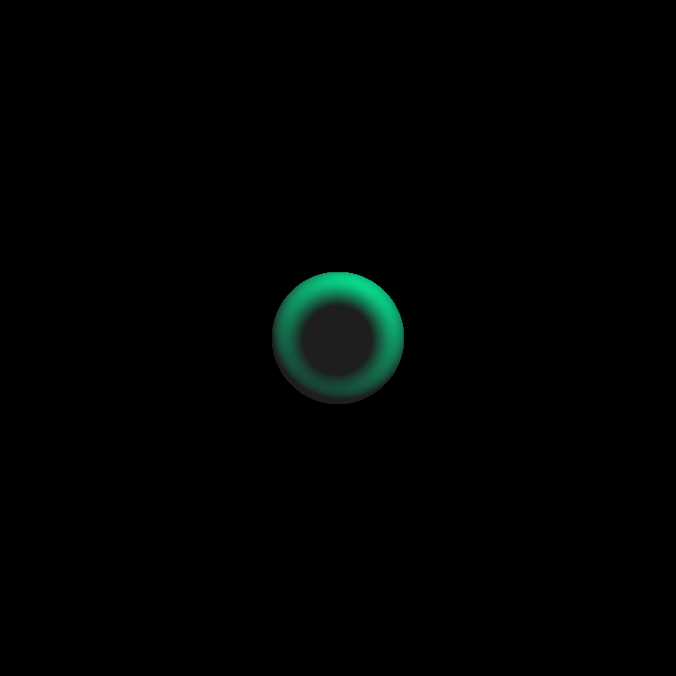
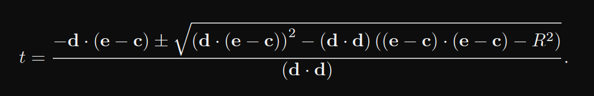

A scene rendered with my ray caster.

# Ray Casting

Ray casting is an image based method of rendering a 3D scene to a 2D image. In short, for each pixel in
a rendered image, a line is drawn from an origin point over 3D space. Wherever these lines, or "rays",
collide with an object, a pixel is rendered given that object's properties.

Fundamentally, there are x components necessary to implement a ray caster. First, a class to represent
a `ray`. Second, a class is needed for the `ViewPort`, which defines the pixel grid in 3D space, and
thus the angles of the rays to 

### Ray

A ray is a line emanating from an origin. The ray, fundamentally, is a set of two three dimensional
vectors. First, we have the `origin` vector. This is the point from which the line that the ray starts.
Second, we have the  `direction`, the direction that the ray is pointing. This `direction` is normalized.

For a perspective ray cast implementation (that is, a ray caster that renders images closest to how
humans perceive objects), the origin will remain fixed relative to the location of the camera, or 'eye'.

We can evaluate the coordinates of any point on the line created by the `origin` and `direction` by
calling the `eval` function; this function returns a 3D Vector, as `o + d(t)`, where `t` is the distance
on this line we are traversing.

### ViewPort

The ViewPort is a grid of coordinates, each representing a pixel of the final image. In a perspective
ray caster, we draw a ray for each of these coordinates, originating from the camera (eye) and moving
through each of these coordinates. The distance that the ViewPort is situated from the eye determines
the final render's field of view.

These rays, along with our scene, are passed to the renderer, where we evaluate each ray and determine
if it hits any objects within our scene. Based on the present lighting and which object is hit first,
we render a colour to the pixel.

### Present Issues

Somewhere, somehow, I don't know how or why, but when I calculate the sphere surface coordiantes where
a ray intersects a sphere, I'm getting a bad value. I do not know if this is my fault or something with
Java, because I've triple checked my code at this point.

If you have a sphere with an origin point O = (0, 0, 12) and a radius of 2.0, you can assume that the
furthest that the sphere extends on any axis is O + R. This means that the furthest coordinate we should
be returned by our ray casting is (0+-2, 0+-2, 12+-2). However, when rendering a sphere, I do not get
get results consistently within this range. I first discovered this when attempting to create my own
shading algorithm, where I was getting results that looked like this:

 

The dimly lit visible centre of the sphere is due to incorrect vectors returned by my rayIntersection
function. This means that, while my discriminant function works, something else isn't.

 

```Java
    public double intersectDiscriminant(Ray ray, double t)
    {
        Vector3D d = ray.eval(t);
        Vector3D e = ray.getOrigin();
        Vector3D c = this.c;
        double R = this.r;

        return (Math.pow( d.dot(e.sub(c)), 2 ) - ( d.dot(d) * ( e.sub(c).dot( e.sub(c) ) ) - Math.pow(R, 2) ) );
    }
```

```Java
    @Override
    public HitDetection rayIntersect(Ray ray, double t)
    {
        double dscrm = intersectDiscriminant(ray, t);

        if(dscrm >= 0)
        {
            Vector3D d = ray.eval(t);
            Vector3D e = ray.getOrigin();
            Vector3D c = this.c;

            // this math may prove to be wrong later!
                     
            double t1 = ( ( 0.0 - d.dot(e.sub(c)) ) - dscrm ) / d.dot(d);
            double t2 = -1.0;

            if (dscrm > 0)
            {
                t2 = ( 0.0 - d.dot(e.sub(c)) + dscrm ) / d.dot(d);
                return new HitDetection( this, t1, t2, ray.eval(t1), ray.eval(t2) );
            }
            else
            {
                return new HitDetection( this, t1, t2, ray.eval(t1), null );
            }
        }
    }
    return null;
}
```
