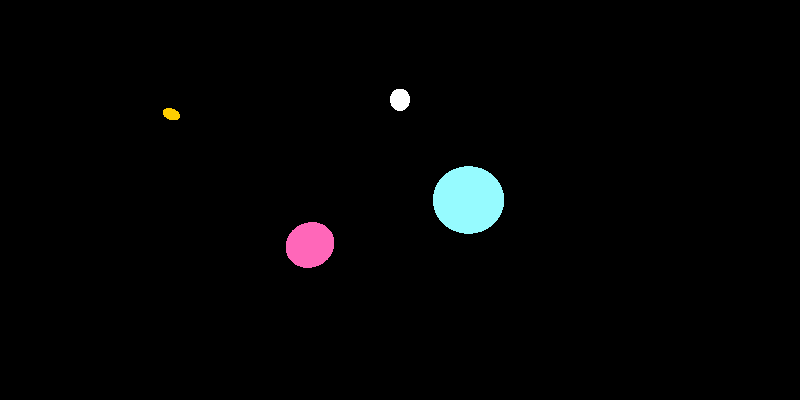

A scene rendered with my ray caster.

# Ray Casting

Ray casting is an image based method of rendering a 3D scene to a 2D image. In short, for each pixel in
a rendered image, a line is drawn from an origin point over 3D space. Wherever these lines, or "rays",
collide with an object, a pixel is rendered given that object's properties.

Fundamentally, there are x components necessary to implement a ray caster. First, a class to represent
a `ray`. Second, a class is needed for the `ViewPort`, which defines the pixel grid in 3D space, and
thus the angles of the rays to 

### Ray

A ray is a line emanating from an origin. The ray, fundamentally, is a set of two three dimensional
vectors. First, we have the `origin` vector. This is the point from which the line that the ray starts.
Second, we have the  `direction`, the direction that the ray is pointing. This `direction` is normalized.

For a perspective ray cast implementation (that is, a ray caster that renders images closest to how
humans perceive objects), the origin will remain fixed relative to the location of the camera, or 'eye'.

We can evaluate the coordinates of any point on the line created by the `origin` and `direction` by
calling the `eval` function; this function returns a 3D Vector, as `o + d(t)`, where `t` is the distance
on this line we are traversing.

### ViewPort

The ViewPort is a grid of coordinates, each representing a pixel of the final image. In a perspective
ray caster, we draw a ray for each of these coordinates, originating from the camera (eye) and moving
through each of these coordinates. The distance that the ViewPort is situated from the eye determines
the final render's field of view.

We construct the ViewPort as a 2x2 grid, centred aroud the camera and exactly one unit offset from
the camera. We then translate our raster image size to coordinates within this 2x2 square, and stretch
the coordinates by the aspect ratio if we are not rendering a square image. Thus we end up with an
`ArrayList` of `ArrayList`s of `Ray` objects.

## Ray - Sphere Intersection
